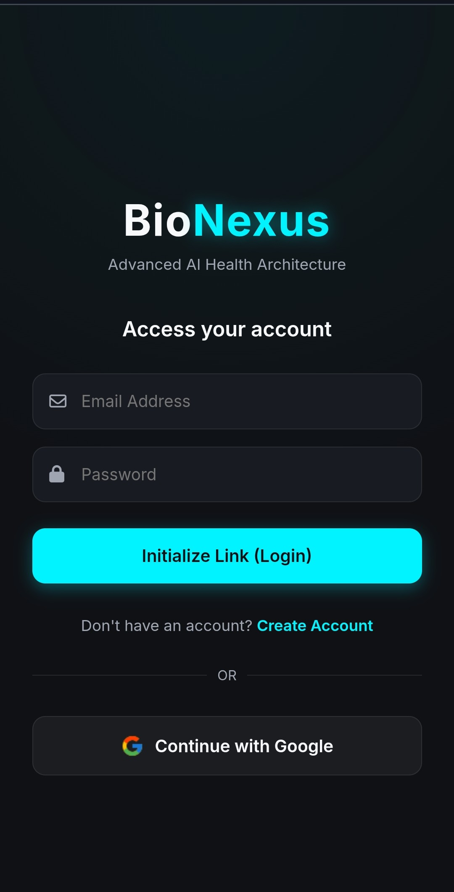
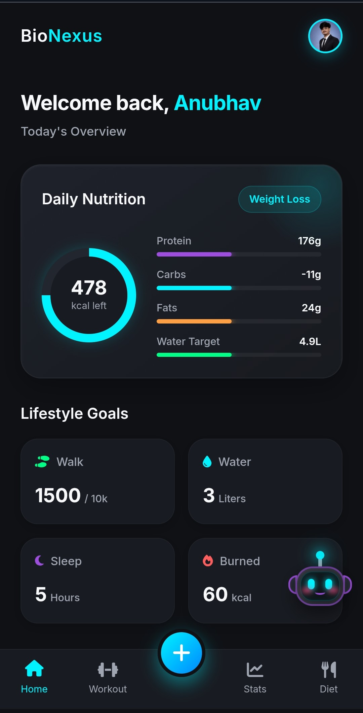
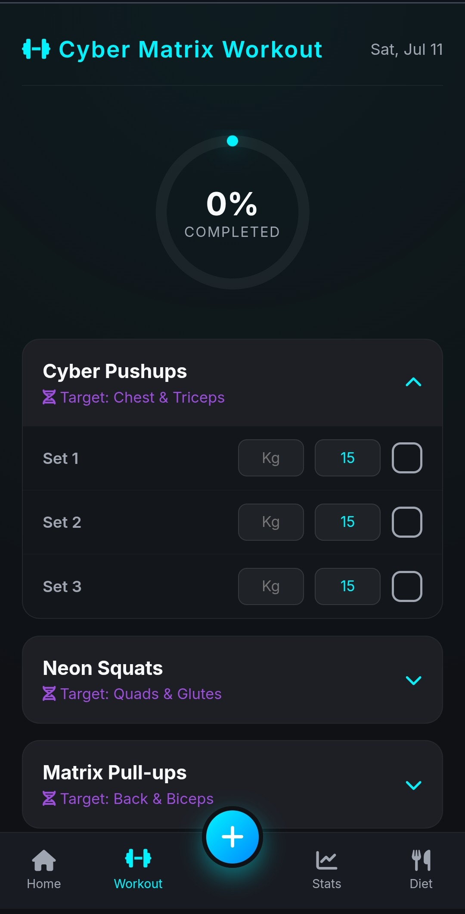
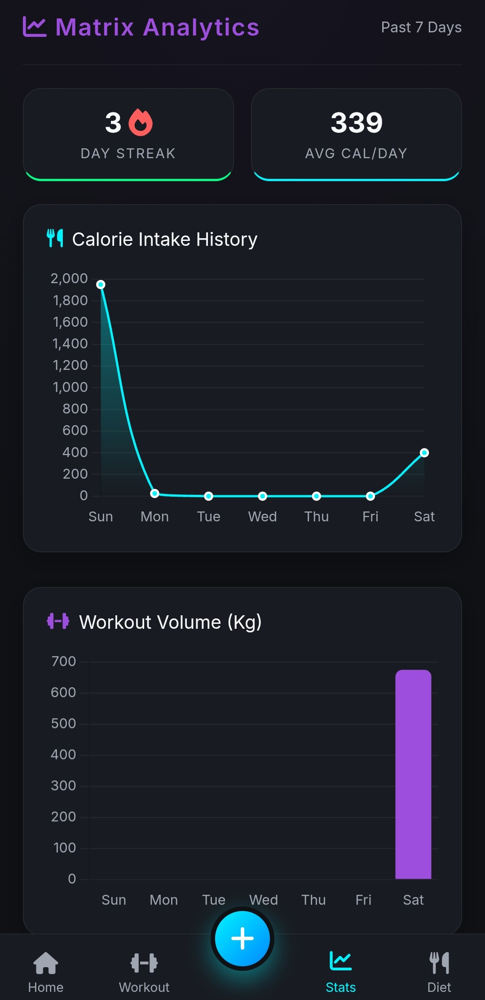
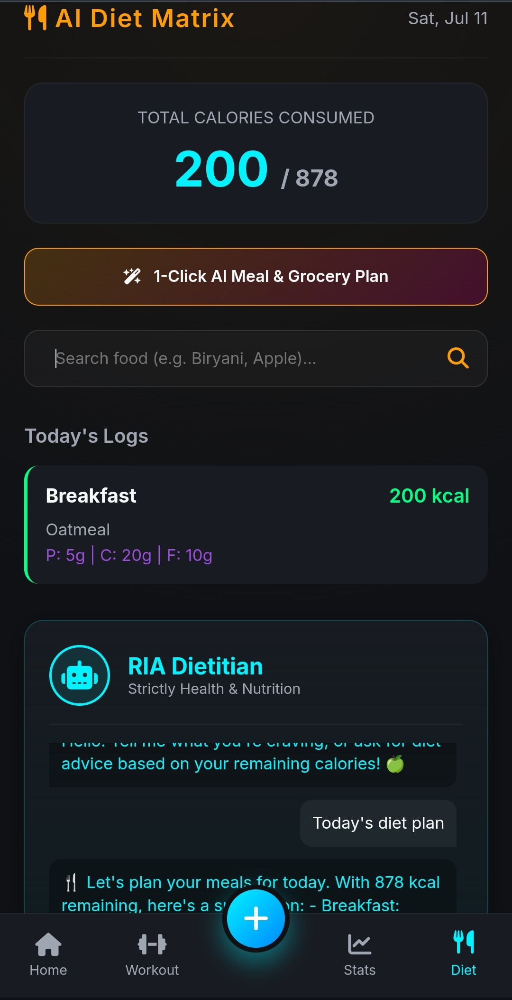

# 🧬 BioNexus | Advanced AI Health Architecture

<p align="center">
  
  
  
  
  
  
  
  
</p>

<p align="center">

### 🚀 Next-Generation AI-Powered Health Tracking Platform

Intelligent Health Analytics • AI Insights • Cyberpunk UI • Secure Authentication

</p>

---

# 🌐 Live Demo

<div align="center">

# 🚀 Experience BioNexus Live

### 🌌 Step into the Future of AI-Powered Healthcare

<p>
<a href="https://bionexus-live.onrender.com" target="_blank">

</a>
</p>


### ⚡ Click the button above to explore BioNexus in action!

</div>

---

# 📖 Overview

**BioNexus** is a next-generation AI-powered health tracking web application designed to deliver intelligent, personalized healthcare experiences through modern Artificial Intelligence.

Powered by **FastAPI**, **MongoDB**, and the **Groq AI Engine**, BioNexus analyzes health data in real time, generates smart recommendations, and presents everything inside a futuristic Cyberpunk-inspired interface.

The application combines beautiful UI design, secure authentication, AI-driven health insights, and scalable backend architecture to provide users with a seamless digital healthcare experience.

---

# ✨ Features

## 🤖 AI Health Core

- AI-powered health analysis
- Real-time health recommendations
- Groq AI integration
- Personalized health insights
- Intelligent diet suggestions
- Workout recommendations
- Health statistics tracking
- Fast AI response generation

---

## 🌌 Cyberpunk UI/UX

- Deep Dark Theme (#0f1115)
- Neon Cyan Highlights (#00f3ff)
- Neon Green Accents (#00ff87)
- Glowing buttons
- Smooth page transitions
- Modern dashboard
- Responsive interface
- Beautiful animations

---

## 🔐 Security & Authentication

- JWT Authentication
- Secure Google OAuth Login
- Protected API Routes
- User Session Management
- Secure Database Communication

---

## 📊 Health Tracking

- Dashboard Overview
- Daily Health Statistics
- AI Diet Planner
- Workout Planner
- Personalized Health Suggestions
- User Profile Management
- Settings Management

---
## 📱 Application Preview

<div align="center">

<table>
<tr>

<td align="center" width="20%">


**🔐 Login**
</td>

<td width="15"></td>

<td align="center" width="20%">


**🏠 Dashboard**
</td>

<td width="15"></td>

<td align="center" width="20%">


**💪 Workout**
</td>

<td width="15"></td>

<td align="center" width="20%">


**📊 Analytics**
</td>

<td width="15"></td>

<td align="center" width="20%">


**🥗 AI Diet**
</td>

</tr>
</table>

<br>

> ✨ **Experience BioNexus through a futuristic Cyberpunk-inspired interface powered by AI.**

</div>

---

### ✨ Experience the BioNexus Interface

| Screen | Description |
|---------|-------------|
| 🔐 **Login Authentication** | Secure JWT & Google OAuth login with a futuristic Cyberpunk design. |
| 🏠 **Main Dashboard** | Personalized health overview, nutrition tracking, hydration, and lifestyle insights. |
| 💪 **Cyber Matrix Workout** | AI-powered workout planner with progress tracking and exercise management. |
| 📊 **Analytics & Stats** | Interactive charts and health analytics to monitor daily performance. |
| 🥗 **AI Diet Maintainer** | Intelligent AI diet planner providing calorie tracking and personalized nutrition recommendations. |

---

# 🛠️ Technology Stack

## Frontend

- HTML5
- CSS3
- JavaScript (ES6)

## Backend

- Python
- FastAPI

## Database

- MongoDB

## AI Engine

- Groq API

## Authentication

- JWT Authentication
- Google OAuth

## Deployment

- Render

---

# 📂 Project Structure

```text
BioNexus/
│
├── backend/
│   ├── ai_engine.py
│   ├── database.py
│   ├── diet_routes.py
│   ├── main.py
│   ├── models.py
│   ├── settings_routes.py
│   ├── stats_routes.py
│   └── workout_routes.py
│
├── frontend/
│   ├── assets/
│   │
│   ├── css/
│   │   ├── dashboard.css
│   │   └── style.css
│   │
│   ├── js/
│   │   ├── api.js
│   │   ├── auth.js
|   |   ├── cyber-doc.js
│   │   ├── dashboard.js
│   │   ├── diet.js
│   │   ├── onboarding.js
│   │   ├── profile.js
│   │   ├── settings.js
│   │   ├── stats.js
|   |   ├── theme-loader.js
│   │   └── workout.js
│   │
│   ├── diet.html
|   ├── cyber-dco.html 
│   ├── index.html
│   ├── intro.html
│   ├── login.html
│   ├── onboarding.html
│   ├── profile.html
│   ├── settings.html
│   ├── stats.html
│   └── workout.html
├── venv 
├── .env
├── .gitignore
├── README.md
└── requirements.txt
```

---

# ⚙️ Installation

## 1. Clone the Repository

```bash
git clone https://github.com/Anubhav2321/Advance_health_tracker.git

cd Advance_health_tracker
```

---

# 🖥️ Backend Setup

Navigate to the backend folder.

```bash
cd backend
```

### Create Virtual Environment

```bash
python -m venv venv
```

### Activate Environment

**Windows**

```bash
venv\Scripts\activate
```

**Linux / macOS**

```bash
source venv/bin/activate
```

---

### Install Dependencies

```bash
pip install -r ../requirements.txt
```

---

### Configure Environment Variables

Create a `.env` file.

```env
MONGODB_URI=your_mongodb_connection_string

JWT_SECRET=your_secret_key

GROQ_API_KEY=your_groq_api_key

GOOGLE_CLIENT_ID=your_google_client_id

GOOGLE_CLIENT_SECRET=your_google_client_secret
```

---

### Start FastAPI Server

```bash
uvicorn main:app --reload
```

Backend runs at

```
http://127.0.0.1:8000
```

---

# 💻 Frontend Setup

Open a new terminal.

Navigate to frontend.

```bash
cd frontend
```

Run a local server using Python.

```bash
python -m http.server 5500
```

or use the **Live Server** extension in VS Code.

Open

```
http://localhost:5500
```

---

# 🚀 API Deployment

Backend is deployed on **Render**.

Live URL

```
https://bionexus-live.onrender.com
```

---

# 🎯 Highlights

- 🤖 AI-Powered Health Analysis
- ⚡ Lightning Fast FastAPI Backend
- 🧠 Groq AI Integration
- 🍃 MongoDB Database
- 🔐 JWT Authentication
- 🔑 Google OAuth Login
- 🌌 Cyberpunk UI Design
- 📊 Smart Health Dashboard
- 🥗 AI Diet Recommendation
- 💪 Workout Planner
- 📱 Responsive Web Application
- ☁️ Cloud Deployment on Render
- 🧠 AI Symptom Prediction
- 🩺 Doctor Consultation
- 📅 Medicine Reminder
- 🥗 AI Nutrition Coach
- 🌍 Multi-language Support
- 📤 PDF Health Reports

---

# 🗺️ Future Roadmap

- ❤️ Heart Rate Monitoring
- ⌚ Smartwatch Integration
- 📈 Health Analytics
- 🎤 Voice Assistant


---

# 🤝 Contributing

Contributions are welcome!

1. Fork the repository

2. Create a new branch

```bash
git checkout -b feature/new-feature
```

3. Commit your changes

```bash
git commit -m "Added new feature"
```

4. Push to your branch

```bash
git push origin feature/new-feature
```

5. Open a Pull Request

---

# 📄 License

This project is licensed under the **MIT License**.

---

# 👨‍💻 Developer

## **Anubhav Samanta**

🎓 BCA (Honours) Student | AI & Full-Stack Developer

- 🌐 Portfolio: https://anubhavsamanta.vercel.app/
- 💻 GitHub: https://github.com/Anubhav2321

---

<p align="center">

# 🧬 BioNexus

### *Empowering the Future of Healthcare Through Artificial Intelligence.*

⭐ **If you found this project helpful, don't forget to Star the repository!**

</p>
